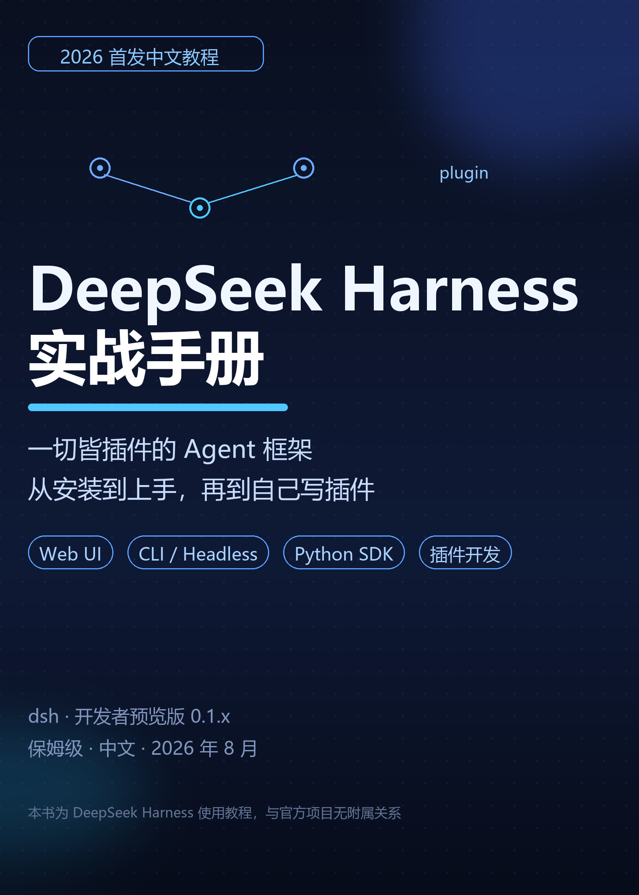

# DeepSeek Harness 实战手册

> 一切皆插件的 Agent 框架，从安装到上手，再到自己写插件。
> 2026 年 8 月 · 对应 dsh 开发者预览版（0.1.x）· 个人整理，非官方出品



DeepSeek Harness（`dsh`）是 DeepSeek 官方开源的 Agent 框架，发布 48 小时 GitHub Star 突破 10 万。本仓库是一份**全中文、零基础、免费**的实战手册，共 17 章 + 实测附录，覆盖：

- 核心概念：插件、Bundle、Profile、Seam、事件
- Web UI 五分钟上手（命令已亲测）
- CLI / 无头模式 / Python SDK
- 插件开发：Hello → 工具 → 配置 → 打包发布
- 架构进阶：Cordis、轮次流程、扩展点
- 综合实战：搭一个每天自动产出周报的 Agent 工作台
- 坑与 FAQ、命令速查、术语表、实测记录

## 在线阅读

**在线版（已部署）：https://zoahdev.github.io/deepseek-harness-handbook/**

也可以打开仓库里的 [index.html](index.html) 本地阅读（封面、目录、全部章节，单文件，无需联网）。

## 部署到 GitHub Pages（免费，5 分钟）

1. 点击右上角 **Fork** 本仓库（或新建仓库后上传本目录全部文件）；
2. 仓库 → **Settings → Pages**；
3. **Source** 选 `Deploy from a branch`，分支选 `main`，目录选 `/ (root)`；
4. Save，等 1-3 分钟，访问：

```text
https://你的用户名.github.io/仓库名/
```

## 内容结构

| 章节 | 内容 |
|---|---|
| 第 1 章 | DeepSeek Harness 是什么 |
| 第 2 章 | 五个核心概念 |
| 第 3 章 | 五分钟上手 Web UI |
| 第 4 章 | 命令行与无头模式 |
| 第 5 章 | Python SDK |
| 第 6-8 章 | 插件开发：入门 → 配置 → 打包发布 |
| 第 9 章 | 架构进阶 |
| 第 10 章 | 实战案例 |
| 第 11 章 | 生态、坑与 FAQ |
| 第 12 章 | 学习路径 |
| 第 13 章 | 综合实战：Agent 工作台 |
| 附录 A-D | 命令速查 / 术语表 / 参考资料 / 实测记录 |

## 配套发布物料（docs/）

- `公众号文章包/`：5 篇成品文章，复制即发
- `小红书图文包/`：9 张卡片 + 3 条笔记文案
- `知乎-长文与回答模板.md`：知乎发布模板
- `短视频脚本.md`：3 条 60-90 秒口播脚本
- `发布与传播攻略.md`、`发布日历.md`：发布策略与第一周行动清单
- `公众号配置.md`：自动回复与欢迎语模板

## 微信读书获取方式

> 打开微信读书 App → 搜索【公众号名】→ 分类选"公众号"→ 加入书架即可阅读，更新自动同步。

## 免责声明

- 本手册为个人整理的教程，与 DeepSeek 官方无附属关系；
- 内容基于官方仓库，写作于 2026 年 8 月；开发者预览版如有变更，以官方仓库为准；
- 涉及命令请先在隔离环境验证后再用于生产。

## 许可证

- 文档与教程文本：[CC BY 4.0](LICENSE.txt)（署名即可，欢迎转载）
- 示例代码：MIT

## 贡献

欢迎提交 Issue / PR 补充新版本解读、插件测评与实战案例。
